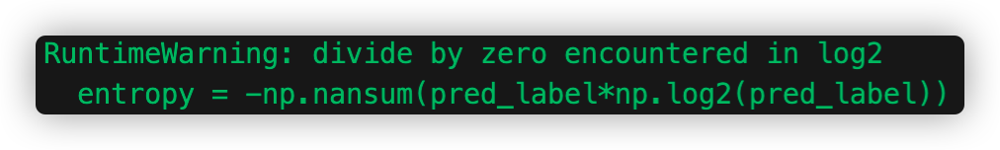

## Introduction
<u>**This is a backdoor detector for bad neural networks** (i.e. DNN with stealthy backdoors) **trained on the YouTube Face dataset.**</u>  
***
**Competition website:** [CSAW_HACKML](https://www.csaw.io/hackml)  
**Methods:** [STRIP](https://arxiv.org/abs/1902.06531) + [Fine-pruning](https://arxiv.org/abs/1805.12185)  
**BadNets:** all BadNets are under **models/**   
**Repaired Models:** under **entropy/** and **finePruning/**  
<mark style="background-color: #595959">(To run it, CPU is fine, but **GPU** will be better)</mark> 
| *Repaired Net after STRIP* | |
| --- | --- |
| **BadNet1** | entropy/entropy_clean_sunglasses.h5 |
| **BadNet2** | entropy/entropy_clean_anonymous1.h5 |
| **BadNet3** | entropy/entropy_clean_anonymous2.h5 |
| **BadNet4** | entropy/entropy_clean_multi.h5 |

| *Repaired Net after Fine-pruning* | |
| --- | --- |
| **BadNet1** | finePruning/sunglasses_repaired_net.h5 |
| **BadNet2** | finePruning/anonymous_1_repaired_net.h5 |
| **BadNet3** | finePruning/anonymous_2_repaired_net.h5 |
| **BadNet4** | finePruning/multi_trigger_multi_target_repaired_net.h5 |

## Environment Requirements
 - python 3.x
 - os
 - numpy
 - keras
 - tensorflow
 - tensorflow_model_optimization
 - h5py
 - scipy
 - matplotlib
 - cv2 (opencv-python)
## Quick Start
1. _(Optional)_ Download the data from [here](https://drive.google.com/drive/folders/1FhMDxD4cezVNk7BhRVSbhdkRwXUTI7oK) into the **data/** directory.
2. Open your terminal and run:  
    > *python eval.py*
3. Follow the instructions from your terminal

## **Attention!!!**
***In the STRIP process, the running time may be very long (e.g. for 10,000 inputs, may need 15min.).***  
***If notice the following warnings from your terminal, you can ignore them.***  

